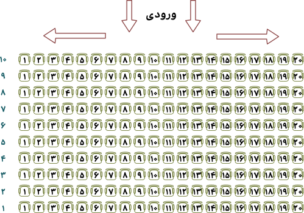

# همایش زندگی بهتر

جمشید کاظمی (که با نام مستعار کامران پوریایی شناخته می‌شود)، به تازگی آدم شده و از زندان آزاد شده است. او در تلویزیون تبلیغ همایش «زندگی بهتر برای فردایی بهتر» را مشاهده‌کرد و تصمیم گرفت در همایش شرکت کند! پس از ثبت‌نام و پرداخت پول گزاف برای این همایش در سایت مربوطه، شماره‌ی ردیف و شماره صندلی‌اش در همایش به او ارسال شد.

می‌دانیم این همایش در سالن همایش برج میلاد برگزار می‌شود. این سالن ۱۰ ردیف دارد و هر ردیف آن ۲۰ صندلی دارد. ردیف‌ها از پایین به بالا با ۱ و ۲ و ... و ۱۰ شماره‌گذاری شده‌اند و صندلی‌های هر ردیف از چپ به راست با ۱ و ۲ و ... ۲۰ شماره‌گذاری شده‌اند.

  

اکنون روز همایش فرا رسیده‌است و جمشید به سالن همایش آمده‌است و از بالا وارد سالن شده‌است. برای آنکه کمتر از میان صندلی‌های یک ردیف عبور کند تا به‌جای خود برسد، اگر شماره صندلی‌اش بین ۱ تا ۱۰ باشد به سمت راست می‌رود و در غیر این‌صورت به سمت چپ می‌رود. از آنجا که سالن تاریک است شماره‌ی ردیف‌ها و صندلی‌ها را نمی‌بیند. برای همین لازم است بداند ردیفش از بالا ردیف چندم است و صندلی‌اش از آن جهتی که وارد ردیف می‌شود صندلی چندم است. برنامه‌ای بنویسید که بگوید به کدام سمت برود و چند ردیف پایین برود و در چندمین صندلی از جهتی که وارد ردیف می‌شود بنشیند.

## ورودی
ورودی تنها شامل یک سطر است که در آن به ترتیب دو عدد طبیعی 
r
 و 
c
 ، شماره‌ی ردیف و شماره صندلی جمشید، آمده‌است.

1 < r ≤ 10

1 < c ≤ 20

## خروجی
در خروجی یک سطر چاپ کنید. اگر جمشید باید به راست برود Right a b و اگر باید به سمت چپ برود Left a b چاپ کنید که a و b به ترتیب شماره ردیف او از بالا و شماره صندلی‌اش از جهتی که وارد می‌شود است.

## مثال
### ورودی ۱

1 1

### خروجی ۱

Right 10 1

### ورودی ۲

4 15

### خروجی ۲

Left 7 6

 
 

منبع: https://quera.org/problemset/10325
